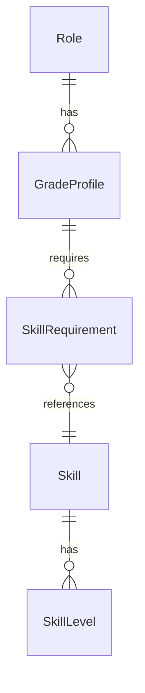

# Архитектура матрицы компетенций

Цель: навыки описываются один раз (по SFIA 9), роли на каждом грейде задают пороги, сайт показывает требования и инструкцию по ассессменту.

---

## Принципы

1. **Только навыки SFIA.** Коды и смысл уровней берутся из SFIA 9. Новые «локальные» навыки не вводятся, если навык уже есть в SFIA.
2. **Skill ≠ Role.** Роль не содержит текста уровней — только `skill_id + min_level + priority`.
3. **Один навык — много ролей.** Пример: `TEST` на Middle iOS/Frontend = L2, на Middle QA = L3.
4. **Грейд — профиль требований**, не отдельный навык.
5. **Контент навыка отделён от процесса оценки.**

---

## Сущности



| Сущность | Где живёт |
| --- | --- |
| Skill | `skills/<code>.md` + `site/data/matrix.json` |
| Role / GradeProfile | `roles/<id>/` + `matrix.json` |
| Источник для сборки | `scripts/build-matrix.mjs` |
| Сайт | `site/` |

---

## Навыки в матрице (SFIA 9)

| Код | Название |
| --- | --- |
| PROG | Programming / software development |
| SWDN | Software design |
| SINT | Systems integration and build |
| TEST | Functional testing |
| NFTS | Non-functional testing |
| HCEV | User experience design |
| USEV | User experience evaluation |
| ACIN | Accessibility and inclusion |
| METL | Methods and tools |
| QUAS | Quality assurance |
| RELM | Release management |

Платформенный контекст (iOS / web / QA) выражается:

1. **набором и порогами** навыков в грейде роли;
2. **рекомендациями по оценке** (`roles.*.assessment` / `scripts/role-assessment.mjs`) — что проверять на уровне навыка именно для этой роли.

Навык остаётся общим (например, PROG). У iOS и Frontend рекомендации к PROG разные; у части навыков (где специфики нет) блок рекомендаций отсутствует — действует текст SFIA.

---

## Роли

- `ios-developer` — акцент PROG / SWDN / SINT
- `frontend-developer` — те же engineering skills + выше пороги HCEV / ACIN
- `qa-engineer` — выше пороги TEST / NFTS / QUAS / USEV; PROG на уровне automation

---

## Сайт ассессмента

Статический UI (`site/`):

1. **Роли** — выбор роли и грейда, таблица требований
2. **Навыки** — каталог и уровни
3. **Оценка** — инструкция: шаги, артефакты, правила, SFIA

Данные: `site/data/matrix.json`.

```bash
node competency-matrix/scripts/build-matrix.mjs
cd competency-matrix/site && python3 -m http.server 4173
```

---

## Правила оценки (кратко)

- Подтверждение: уровень кандидата ≥ `min_level` для всех `required`
- Оценивается прирост целевого уровня; артефакты обязательны
- `optional` не блокирует грейд
- Подтверждённый уровень навыка переносится между ролями

Подробности — раздел «Оценка» на сайте и `assessment_guide` в `matrix.json`.
